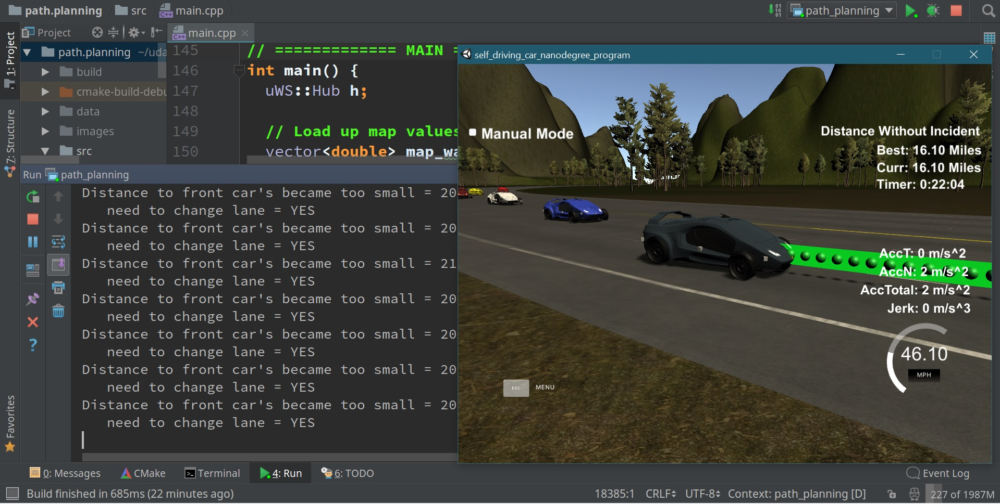

# README: CarND-Path-Planning-Project
Self-Driving Car Engineer Nanodegree Program

# Model Documentation

#### Screenshot:


### Build and Run
1. Install all pre-requisites and dependencies which are described in original Udacity ReadMe.
2. Unzip archive.
3. Change directory to where unpacked files are.
4. Then run from shell (command line)
	* mkdir build
	* cd build
	* cmake .. && make
	* ./path_planning
5. You will see message:
	* Listening to port 4567
6. Start simulator and select otions, click on Play, on next screen press on **SELECT**.
7. Simulation will start.

### Approach

It is inspired by and partially based on the Udacity project walkthrough.

   In this approach, Frenet coordinates (s, d) are used instead of standard Cartesian coordinates (x, y) because they make path planning simpler.

Frenet system _notation_:
* s -- longitudinal displacement along the road;
* d -- lateral displacement from the center (yellow) dividing line.

There are 3 essential divisions of the project components:

1. Sensor fusion: comprehending traffic situation around our car
2. Path planning: deciding lane change behavior
3. Trajectory planning

### Sensor Fusion: comprehending traffic situation around our car

Usually, an autonomous car is equipped with many different sensors such as video-cam, radar(s), lidar, gps, inertial navigation system.
They incessantly supply data about situation around the car,
so self-driving software can decide:
* what cars and other objects are near it;
* are they moving;
* how fast they are;
* and so on.

The simulator for our project gives us reduced data set -- only those cars which are moving on the same side of road on which our car is moving. There is no data about vehicles at the opposite side of the road.

In our algorithm, we first examine sensor fusion information to decide car's reference speed 
* check whether a vehicle is moving in the same lane as ours, in front of our car,  not exceeding the limit of 30 meters. If that the case, then move behind it at the same speed;
* check whether a vehicle is moving in the same lane as ours, in front of our car,  not exceeding the limit of 20 meters.  If that the case, then slow down to the speed which is lower than that of the front vehicle; 
* check whether our lane before us is free. If that the case, then keep a reference speed of 48 MPH, so that our car does not exceed speed restriction.

This piece is located in file *main.cpp*, lines 274 to 331.

### Path Planning: Lane Change Behavior

Planning of lane change utilizes uncomplicated heuristics, exploring only the adjacent lanes during trajectory construction. We prefer to keep our lane, except when the place in front of us is occupied by a vehicle, on that occasion we attempt to discover a free lane where we could travel in safety.

* Keep our lane, moving at reference speed provided there are no obstacles.
* However, when there is vehicle in front of us (as described earlier), then make mark to change lane.
* For this goal, examine the lane to the left of the current lane (unless we are already in the leftmost lane). Determine the nearest front and back gaps in the left lane. When there is sufficient room forwards (20 meters) and backwards (13 meters), decide that goal lane will be the left lane.
* If left lane is occupied, then examine the lane to the right of the current lane (unless we are already in the rightmost lane). Do identical steps as above, and decide if goal lane should be the right one.

These steps are located in file *main.cpp*, lines 333 to 385,
and in the function *is_lane_safe*, lines 67 to 142.

### Trajectory Planning

As reminder, Frenet coordinates are utilized for path formation with given _d_ value for the goal lane and reference speed. 

We use the technique of the _anchor points_ as explained by the project walkthrough. 
Rather than using great quantity of waypoints, this technique utilizes three waypoints which are broadly spaced 30 meters apart and finds smooth trajectory between them by spline interpolation. 

In order to keep acceleration less than 10 meters per sec^2, the reference speed is amended by +/- acceleration delta. 

First, three anchor points are transformed to the local system of coordinates (by rotation and shift), 
then interpolated points are evenly distributed for every point to be traveled in 0.02 seconds. 

These steps are located in file *main.cpp*, lines 438 to 489,
and in the function *is_lane_safe*, lines  67 to 142.

This constitutes the end of our path planning. After that, the resulting points coordinates transformed again to Frenet system, and at last they are transmitted to the sim engine.

## Conclusion

Our vehicle could move safely along the whole track keeping speed a little less than fifty MPH without breaking restrictions and rules. The car was tested with different travel distances from 2 to 16 miles without failure. 

#### Possible Improvements

Despite this success, some constraints exist due to the uncomplicated decision making. 

Due to the fact our vehicle tries to keep its current lane and checks first for free left lane, it could bog down following slow car(s) in front of it in the left lane, though the right lane is free, however eventually this is resolved properly.
 
Sometimes, our vehicle could move hither and thither from left to central lanes and back again, because of obstacles in front of the car, however in course of time the subject also is taken care of.

Another limitation is that at the moment there is no overt cost function calculation, i.e. this is handled by using boolean variables to indicate whether adjacent lane is free and feasible to traverse into, so there's no fine-grained control. A preferable way may be implementing explicit cost function(s) assessing different costs dependent on:

* vehicles occupying adjacent lanes
* possible collisions
* existing trajectories
* jerk minimization also may be used for smoothing feasible trajectories.

# END of Model Documentation

-----------------------

-----------------------

-----------------------


## Original Udacity ReadMe:
# CarND-Path-Planning-Project
Self-Driving Car Engineer Nanodegree Program
   
### Simulator.
You can download the Term3 Simulator which contains the Path Planning Project from the [releases tab (https://github.com/udacity/self-driving-car-sim/releases).

### Goals
In this project your goal is to safely navigate around a virtual highway with other traffic that is driving +-10 MPH of the 50 MPH speed limit. You will be provided the car's localization and sensor fusion data, there is also a sparse map list of waypoints around the highway. The car should try to go as close as possible to the 50 MPH speed limit, which means passing slower traffic when possible, note that other cars will try to change lanes too. The car should avoid hitting other cars at all cost as well as driving inside of the marked road lanes at all times, unless going from one lane to another. The car should be able to make one complete loop around the 6946m highway. Since the car is trying to go 50 MPH, it should take a little over 5 minutes to complete 1 loop. Also the car should not experience total acceleration over 10 m/s^2 and jerk that is greater than 50 m/s^3.

#### The map of the highway is in data/highway_map.txt
Each waypoint in the list contains  [x,y,s,dx,dy] values. x and y are the waypoint's map coordinate position, the s value is the distance along the road to get to that waypoint in meters, the dx and dy values define the unit normal vector pointing outward of the highway loop.

The highway's waypoints loop around so the frenet s value, distance along the road, goes from 0 to 6945.554.

## Basic Build Instructions

1. Clone this repo.
2. Make a build directory: `mkdir build && cd build`
3. Compile: `cmake .. && make`
4. Run it: `./path_planning`.

Here is the data provided from the Simulator to the C++ Program

#### Main car's localization Data (No Noise)

["x"] The car's x position in map coordinates

["y"] The car's y position in map coordinates

["s"] The car's s position in frenet coordinates

["d"] The car's d position in frenet coordinates

["yaw"] The car's yaw angle in the map

["speed"] The car's speed in MPH

#### Previous path data given to the Planner

//Note: Return the previous list but with processed points removed, can be a nice tool to show how far along
the path has processed since last time. 

["previous_path_x"] The previous list of x points previously given to the simulator

["previous_path_y"] The previous list of y points previously given to the simulator

#### Previous path's end s and d values 

["end_path_s"] The previous list's last point's frenet s value

["end_path_d"] The previous list's last point's frenet d value

#### Sensor Fusion Data, a list of all other car's attributes on the same side of the road. (No Noise)

["sensor_fusion"] A 2d vector of cars and then that car's [car's unique ID, car's x position in map coordinates, car's y position in map coordinates, car's x velocity in m/s, car's y velocity in m/s, car's s position in frenet coordinates, car's d position in frenet coordinates. 

## Details

1. The car uses a perfect controller and will visit every (x,y) point it recieves in the list every .02 seconds. The units for the (x,y) points are in meters and the spacing of the points determines the speed of the car. The vector going from a point to the next point in the list dictates the angle of the car. Acceleration both in the tangential and normal directions is measured along with the jerk, the rate of change of total Acceleration. The (x,y) point paths that the planner recieves should not have a total acceleration that goes over 10 m/s^2, also the jerk should not go over 50 m/s^3. (NOTE: As this is BETA, these requirements might change. Also currently jerk is over a .02 second interval, it would probably be better to average total acceleration over 1 second and measure jerk from that.

2. There will be some latency between the simulator running and the path planner returning a path, with optimized code usually its not very long maybe just 1-3 time steps. During this delay the simulator will continue using points that it was last given, because of this its a good idea to store the last points you have used so you can have a smooth transition. previous_path_x, and previous_path_y can be helpful for this transition since they show the last points given to the simulator controller with the processed points already removed. You would either return a path that extends this previous path or make sure to create a new path that has a smooth transition with this last path.

## Tips

A really helpful resource for doing this project and creating smooth trajectories was using http://kluge.in-chemnitz.de/opensource/spline/, the spline function is in a single hearder file is really easy to use.

---

## Dependencies

* cmake >= 3.5
 * All OSes: [click here for installation instructions](https://cmake.org/install/)
* make >= 4.1
  * Linux: make is installed by default on most Linux distros
  * Mac: [install Xcode command line tools to get make](https://developer.apple.com/xcode/features/)
  * Windows: [Click here for installation instructions](http://gnuwin32.sourceforge.net/packages/make.htm)
* gcc/g++ >= 5.4
  * Linux: gcc / g++ is installed by default on most Linux distros
  * Mac: same deal as make - [install Xcode command line tools]((https://developer.apple.com/xcode/features/)
  * Windows: recommend using [MinGW](http://www.mingw.org/)
* [uWebSockets](https://github.com/uWebSockets/uWebSockets)
  * Run either `install-mac.sh` or `install-ubuntu.sh`.
  * If you install from source, checkout to commit `e94b6e1`, i.e.
    ```
    git clone https://github.com/uWebSockets/uWebSockets 
    cd uWebSockets
    git checkout e94b6e1
    ```

## Editor Settings

We've purposefully kept editor configuration files out of this repo in order to
keep it as simple and environment agnostic as possible. However, we recommend
using the following settings:

* indent using spaces
* set tab width to 2 spaces (keeps the matrices in source code aligned)

## Code Style

Please (do your best to) stick to [Google's C++ style guide](https://google.github.io/styleguide/cppguide.html).

## Project Instructions and Rubric

Note: regardless of the changes you make, your project must be buildable using
cmake and make!


## Call for IDE Profiles Pull Requests

Help your fellow students!

We decided to create Makefiles with cmake to keep this project as platform
agnostic as possible. Similarly, we omitted IDE profiles in order to ensure
that students don't feel pressured to use one IDE or another.

However! I'd love to help people get up and running with their IDEs of choice.
If you've created a profile for an IDE that you think other students would
appreciate, we'd love to have you add the requisite profile files and
instructions to ide_profiles/. For example if you wanted to add a VS Code
profile, you'd add:

* /ide_profiles/vscode/.vscode
* /ide_profiles/vscode/README.md

The README should explain what the profile does, how to take advantage of it,
and how to install it.

Frankly, I've never been involved in a project with multiple IDE profiles
before. I believe the best way to handle this would be to keep them out of the
repo root to avoid clutter. My expectation is that most profiles will include
instructions to copy files to a new location to get picked up by the IDE, but
that's just a guess.

One last note here: regardless of the IDE used, every submitted project must
still be compilable with cmake and make./

## How to write a README
A well written README file can enhance your project and portfolio.  Develop your abilities to create professional README files by completing [this free course](https://www.udacity.com/course/writing-readmes--ud777).

